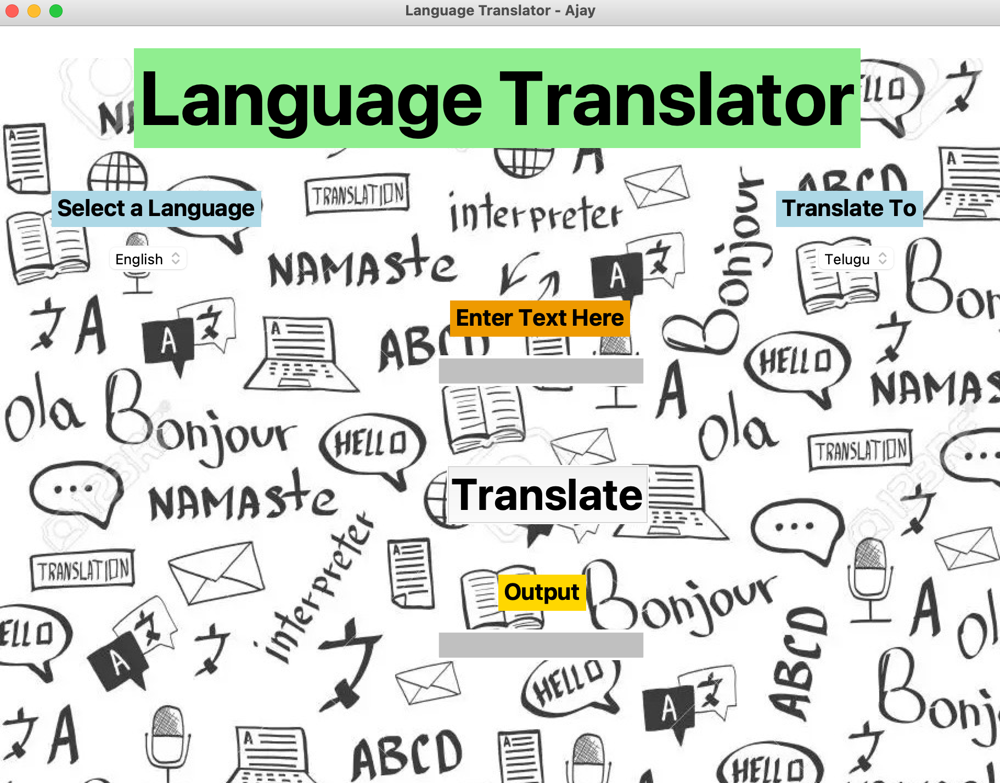
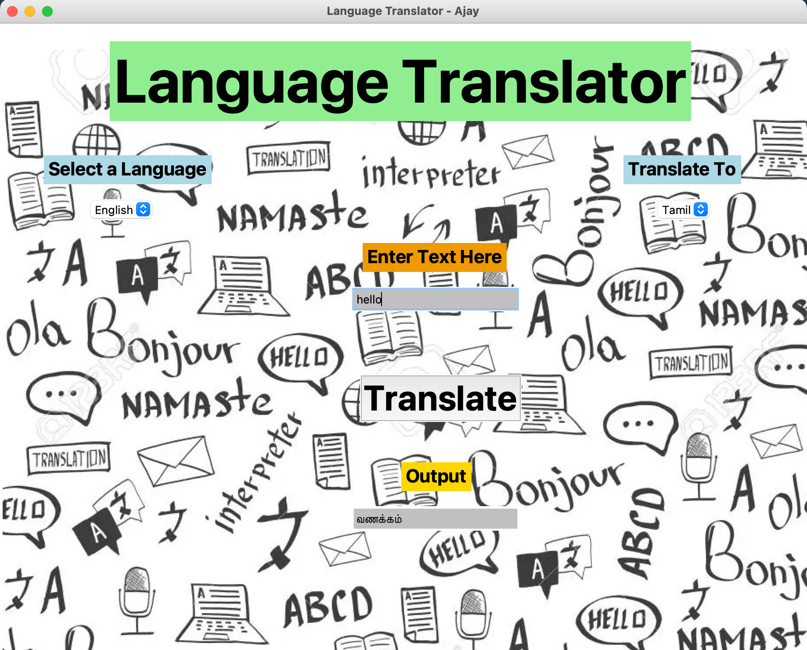

# Language Translation using Python

To master a language one should start creating mini projects on it and practically use the language. Here we are going to create yet another interesting project using Python. We are creating Python Language Translation project so let’s get started.

A language translator is a very handy application that helps us to communicate in different languages by translating our language to the desired language. In earlier times, when there were no Language Translation Applications, it was very difficult for people to communicate with people coming from different parts of the world. Today we can create our own language translation project using python. Let’s see how.

# About Python Language Translation Project

Our objective is to create a Language Translator which would help us translate a word, sentence or even a paragraph to another language. We will try to incorporate as many languages as possible. We will be using Tkinter Module to build our GUI for the project.
In this project, a language will be chosen from a list of options in which the text is to be entered, and also the language in which the text is to be translated is also selected from the list of options. After selecting the languages, the translate button will be clicked to translate the text.

# Project Prerequisites

`pip install tk`

`pip install translate`

`pip install PIL`

# Project File Structure:

Steps to develop Python Language Translator with GUI:

    1)Installing translate
    2)Importing translate and tkinter
    3)Initializing window
    4)Creating tuple for choosing languages
    5)Creating a function for translating the text
    6)Choice for input language and the language in which the text is to be translated
    7)Input and Output text

# Python Language Translator Output

Initial 

Result

# Summary

We have successfully developed python language translator project with translate and tkinter.We used Tkinter Library for creating an easy and effective GUI. Also, we learned how to use these and effectively create a Language Translator. Now we can easily communicate with anybody without even knowing their native language.